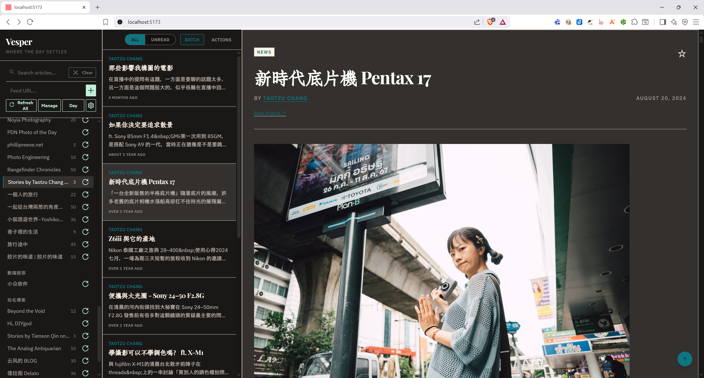
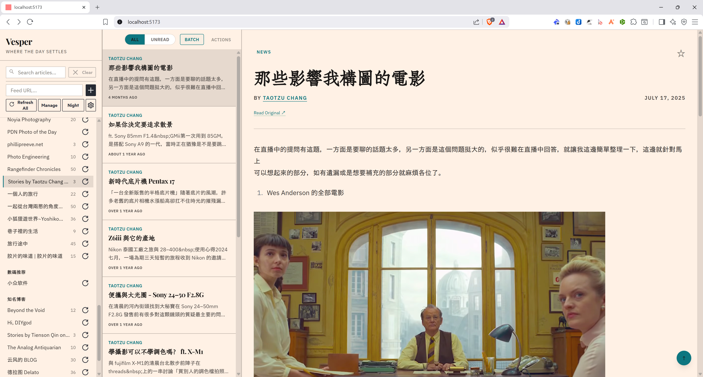

# Vesper

> "Where the day settles."

An elegant, sophisticated, completely offline-first RSS reader that looks and feels exactly like reading the Financial Times in 2025.


## Features

- 🌙 **Offline-capable** — Local storage with IndexedDB; PWA-ready with service worker for caching
- 💻 **Desktop-first** — Three-panel FT.com-inspired layout optimized for desktop browsers (responsive design in progress)
- 🔄 **Smart sync** — Manual feed refresh with intelligent archiving (top 50 unread preserved for newly fetched articles)
- 📥 **OPML support** — Import and export your feeds
- 🎨 **Beautiful UI** — FT Origami O3 design tokens with custom typography
- 🔍 **Fast search** — Tokenized search across article titles, content, and snippets
- 🌓 **Dark & light modes** — Seamless theme switching

## Screenshots

**Dark Mode**


**Light Mode**


## Quick Start

1. **Install dependencies:**

    ```bash
    npm install
    ```

2. **Run development server:**

    ```bash
    npm run dev
    ```

    Open [http://localhost:5173](http://localhost:5173)

3. **Build for production:**
    ```bash
    npm run build
    ```

## Desktop App

Vesper can be packaged as a native desktop application using [Pake](https://github.com/tw93/Pake), turning it into a lightweight (~5MB) offline-capable app for macOS, Windows, and Linux.

### Build Your Own Desktop App

**Note:** Automated GitHub Actions builds are currently experimental. Manual local builds are recommended.

#### Prerequisites

Install Pake CLI:

```bash
npm install -g pake-cli
```

**Platform-specific requirements:**

- **Linux**: `sudo apt-get install libwebkit2gtk-4.1-dev build-essential curl wget libssl-dev libgtk-3-dev libayatana-appindicator3-dev librsvg2-dev`
- **macOS**: Xcode Command Line Tools (already installed if you have `git`)
- **Windows**: Visual Studio Build Tools (already installed if you have Node.js)

#### Build Steps

1. **Build and preview Vesper:**

    ```bash
    npm run build
    npm run preview
    # Runs on http://localhost:4173
    ```

2. **Package with Pake (in a new terminal):**

    ```bash
    pake http://localhost:4173 \
      --name "Vesper RSS" \
      --icon ./static/vesper.ico \
      --width 1400 \
      --height 900
    ```

    **Icon formats:**
    - Linux/Mac: Use `./static/icon-512.png` (512x512px PNG required)
    - Windows: Use `./static/vesper.ico` (Windows ICO format)

3. **Install the generated app:**
    - **macOS**: Open the `.dmg` file and drag to Applications
    - **Windows**: Run the `.msi` installer
    - **Linux**: Install with `sudo dpkg -i Vesper-RSS_x86_64.deb`

### Desktop App Settings

For desktop apps (without the server-side proxy):

1. Open Vesper
2. Go to **Settings** (gear icon)
3. Enable **Direct Fetch Mode**
4. **Important:** Some feeds may fail due to CORS policy. If feeds don't load, disable Direct Fetch Mode and consider using a CORS proxy.

**How Direct Fetch Mode works:**

- ✅ **Works with**: CORS-friendly feeds (personal blogs, GitHub Pages, Medium)
- ⚠️ **May fail**: Major news sites, commercial feeds (CORS restrictions)
- 💡 **Tip**: If feeds don't load, try adding different feeds or disable Direct Fetch Mode

### Automated Releases (Experimental)

GitHub Actions workflow exists but requires system dependencies. Manual builds are currently more reliable:

```bash
# Trigger experimental automated build
git tag v1.0.0
git push origin v1.0.0
```

**Status:** Automated builds are experimental due to Pake's native dependencies. Use manual builds for reliable results.

## Development

```bash
npm run dev           # Start dev server (localhost:5173)
npm run build         # Build for production
npm run preview       # Preview production build locally
npm run check         # Type-check with svelte-check
npm run check:watch   # Watch mode type-checking
npm run test          # Run tests with Vitest
npm run test:ui       # Run tests with UI
npm run test:coverage # Run tests with coverage report
npm run lint          # Lint code with ESLint
npm run lint:fix      # Fix linting issues automatically
npm run format        # Check code formatting with Prettier
npm run format:fix    # Format code with Prettier
```

See [AGENTS.md](./AGENTS.md) for detailed architecture and code conventions.

## Tech Stack

- **Framework**: SvelteKit 2 (SSR off, prerendered SPA)
- **Database**: Dexie.js (IndexedDB) for local storage
- **Styling**: Tailwind CSS + FT Origami O3 design tokens
- **UI**: Skeleton Labs
- **Fonts**: Playfair Display (headlines) & IBM Plex Sans (body)
- **Key Libraries**: fast-xml-parser, DOMPurify, date-fns

## Configuration

### Environment Variables

- `VITE_FEED_PROXY_BASE` (optional): Custom proxy URL for fetching RSS feeds. Defaults to `/api/fetch-feed` on the same origin.

### Search

Search tokenizes article titles, content, and snippets with:

- Stop-word filtering (63 common words excluded)
- Minimum word length: 2 characters
- Unique token extraction for fast queries

### Security

Article content is sanitized using DOMPurify with strict HTML tag whitelisting:

- **Allowed tags**: `b`, `i`, `em`, `strong`, `a`, `p`, `br`, `ul`, `ol`, `li`, `blockquote`, `img`, `h1-h4`, `code`, `pre`
- **Allowed attributes**: `href`, `src`, `alt`, `title`, `class`, `target`

## Project Structure

```
src/
├── lib/
│   ├── db.ts          # Dexie database & types
│   ├── stores.ts      # Svelte stores
│   ├── rss.ts         # Feed syncing logic
│   ├── search.ts      # Search tokenization
│   ├── opml.ts        # OPML import/export
│   └── components/    # Reusable UI components
└── routes/
    ├── +layout.ts     # Root layout (SSR disabled)
    ├── api/           # API endpoints
    └── ...            # Page routes
```

## Contributing

We welcome contributions! See [CONTRIBUTING.md](./CONTRIBUTING.md) for guidelines.

## Code of Conduct

This project follows the [Contributor Covenant](./CODE_OF_CONDUCT.md) Code of Conduct.

## License

MIT — See [LICENSE](./LICENSE) for details.

## Acknowledgments

- [Financial Times](https://ft.com) for design inspiration
- [SvelteKit](https://kit.svelte.dev) team
- [Dexie.js](https://dexie.org) for excellent IndexedDB abstraction
- [Skeleton Labs](https://www.skeleton.dev) for UI components
