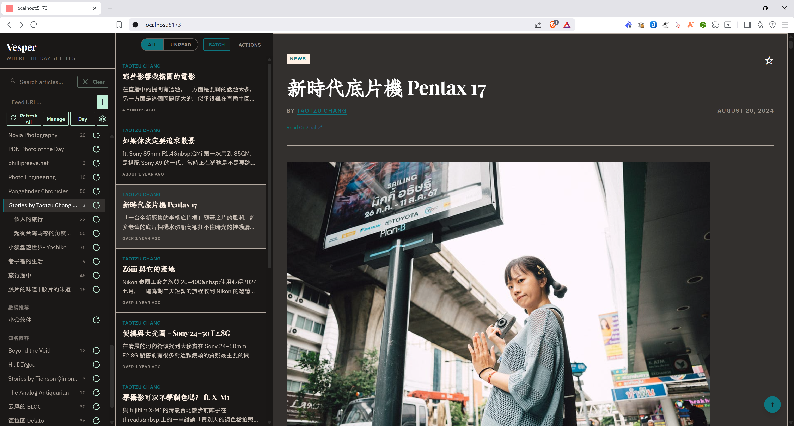
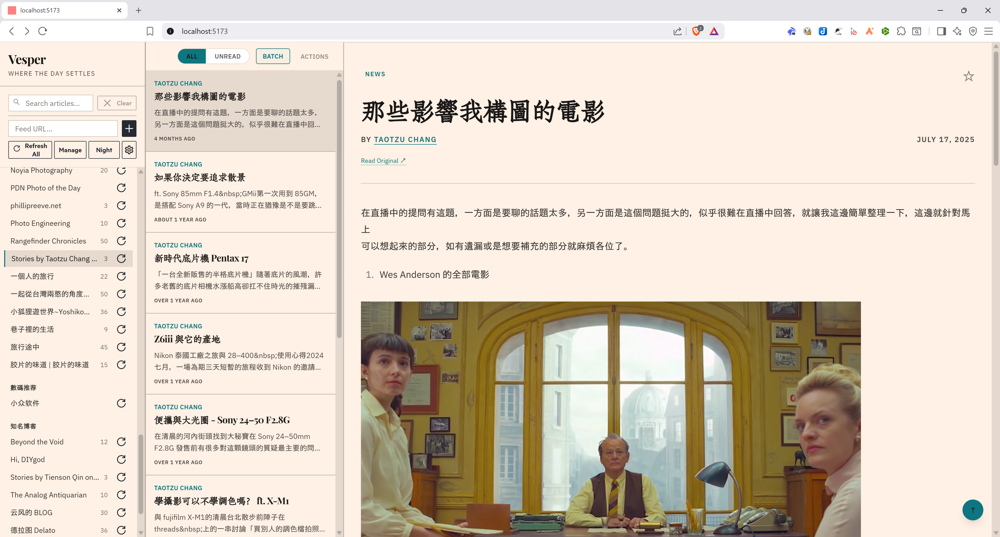

# Vesper

> "Where the day settles."

An elegant, offline-first RSS reader inspired by the Financial Times.

**Try it live:** [reader.liu.nz](https://reader.liu.nz)


## Features

- **Offline-first** — IndexedDB via Dexie; PWA-ready with a service worker
- **Desktop-first** — Three-panel FT-inspired layout (responsive still evolving)
- **Starter feeds** — One-click sample feeds or a full starter pack on first open
- **Smart sync** — Manual refresh with intelligent archiving (top 50 unread kept)
- **OPML** — Import and export subscriptions
- **Search** — Tokenized search across titles, content, and snippets
- **Dark & light** — Theme switching with FT Origami O3 tokens
- **Keyboard** — `?` for shortcuts, `j`/`k` articles, `b` sidebar, `z` zen mode

## Screenshots

**Dark mode**  


**Light mode**  


## Quick start

```bash
npm install
npm run dev        # http://localhost:5173
npm run build
npm run preview
```

On first open: pick a **starter feed**, load the **starter pack**, paste a feed URL, or import **OPML**.

## Development

```bash
npm run check          # svelte-check
npm run test           # Vitest
npm run lint
npm run format
```

See [AGENTS.md](./AGENTS.md) for architecture and conventions.

**Desktop packaging (Pake):** [docs/desktop.md](./docs/desktop.md)

## Tech stack

- SvelteKit 2 (SPA, SSR off)
- Dexie.js (IndexedDB)
- Tailwind + FT Origami O3
- Self-hosted Playfair Display & IBM Plex Sans
- fast-xml-parser, DOMPurify, date-fns

## Configuration

- `VITE_FEED_PROXY_BASE` (optional) — custom RSS proxy; defaults to `/api/fetch-feed` on the same origin

Feed fetching is rate-limited server-side with SSRF guards. Article HTML is sanitized with DOMPurify.

## Contributing

See [CONTRIBUTING.md](./CONTRIBUTING.md) and the [Code of Conduct](./CODE_OF_CONDUCT.md).

## License

MIT — see [LICENSE](./LICENSE).

## Acknowledgments

- [Financial Times](https://ft.com) for design inspiration
- [SvelteKit](https://kit.svelte.dev), [Dexie.js](https://dexie.org), [Skeleton Labs](https://www.skeleton.dev)
